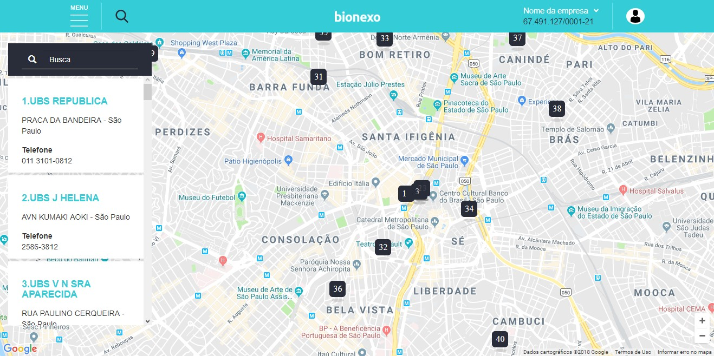
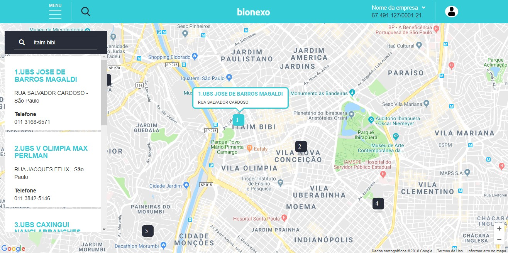
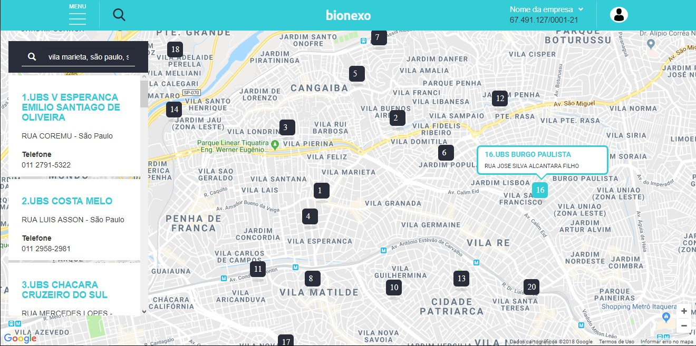

# Case bionexo

- Back-End: Api que retorna os UBS mais próximos de uma certa coordenada [latitude, longitude].
- Front-End: Recebe o endereço digitado no campo de busca e envia a longitute e latide para o Back-End e depois mostra os resultados no mapa.

## Tecnologias:
* ReactJS
* Sass
* Bootstrap
* Express.js
* MongoDB
* Node.JS

## Instalação:

É necessário ter Node v8 e npm instalado em seu computador.

### Back-End
Utilize os seguintes comandos para inicializar a API:

```sh
$ cd server
$ npm install
$ npm run seed:institute
```

Obs: A API utiliza o MongoDB conectado ao Atlas, para adqurir um cluster de graça utilize este link: https://www.mongodb.com/cloud/atlas, depois de inicializar o cluster, certifique-se de criar um usuario para o mesmo. Feito isso, renomeie o .env_default para .env e configure com suas credenciais:

```env
MONGO_ATLAS_USER=USUARIO_DB
MONGO_ATLAS_PW=SENHA_DB
```

Caso você queira usar um banco de dados local, será preciso alterar os arquivos app/app.js e db/seeds/InstitutesSeeder.js.

Depois de tudo configurado, é só rodar:

```sh
$ npm start
```

### Front-End

Utilize os seguintes comandos para inicializar o front-end:

```sh
$ cd client
$ npm install
```

Feito isso, renomeie o arquivo .env_default para .env e troque o GOOGLE_KEY pela sua chave da API do Google Maps, caso você não tenha uma, utilize o seguinte link: https://cloud.google.com/maps-platform/?hl=pt-BR, é importante você ativar a plataforma de Geolocalização e a Maps API para o front-end funcionar perfeitamente.
```env
REACT_APP_GOOGLE_MAPS_API=GOOGLE_KEY
```

Depois de tudo instalado, é só rodar:

```sh
$ npm start
```

## Testing:

Para testar ambos ambientes (Front-End ou Back-End), basta estar na pasta raiz dele e rodar:

```sh
$ npm test
```

## Screenshots:





## Observações:

Existem duas rotas de teste que estão comentadas no arquivo: server/app/routes/v1/institute.js.
